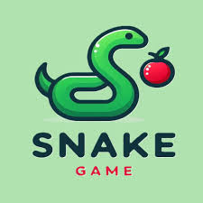
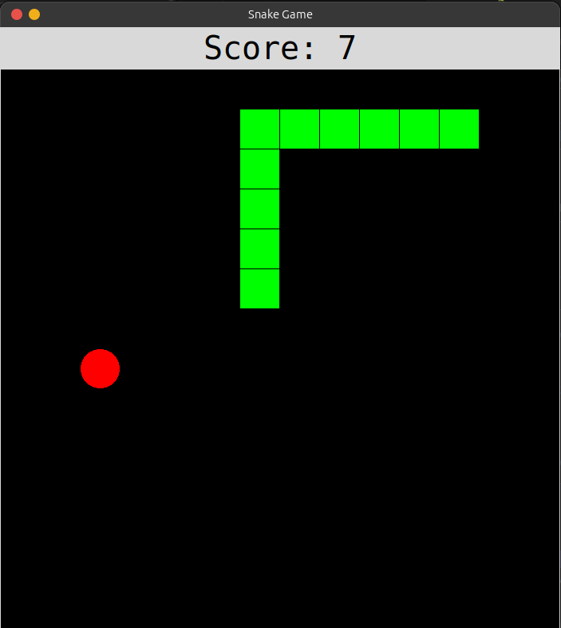
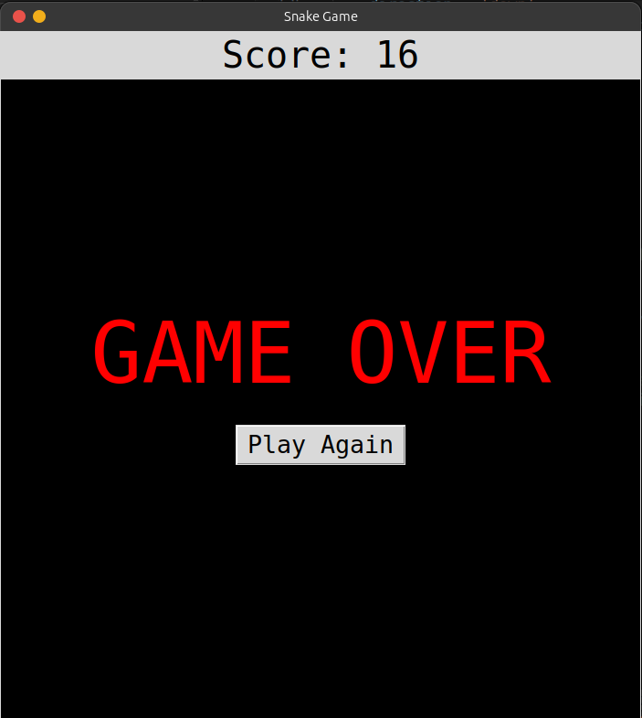

# Snake Game 🐍








This project is a simple implementation of the classic Snake game using Python and the Tkinter library for the graphical interface.

## Description

The goal of the game is to control the snake that moves around the board, eat the food, and avoid crashing into the edges or into your own body. Each time the snake eats, it grows and the score increases. If the snake collides with something, the game is over, and a button will appear to restart the game.

## Installation and Execution

1. Make sure you have Python 3 installed on your system.
2. Clone this repository or download the ZIP file.
3. Navigate to the project folder:
    ```bash
    cd snake_game
    ```
4. Run the game:
    ```bash
    python main.py
    ```

## Controls

- **Up Arrow**: Move the snake up.
- **Down Arrow**: Move the snake down.
- **Left Arrow**: Move the snake left.
- **Right Arrow**: Move the snake right.

## Requirements

This project uses the Tkinter library, which is included in the standard Python installation. No additional dependencies are required.
